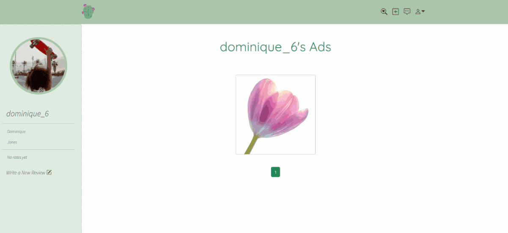

# Planty 

Planty is an online marketplace web application where users can register and post plant ads. The project is my first non-tutorial Django application.

It was developed on Windows OS with Python 3.9.5

## Requirements:
- Python 3.0 or newer verison
- Python requirements are listed in the [requirements](requirements.txt) file

## Installation:
To run the project for the first time run the following:
```bash
# Clone the project
git clone https://github.com/malisara/planty.git

# Create a virtual Python environment (make sure to use at least Python 3)
python -m venv <venv_name>

# Activate virtual environment
.\<venv_name>\Scripts\activate

# Install the requirements
pip install -r /<path_to_the_file>/requirements.txt

# Migrate database
python manage.py migrate

# Run the local server
python manage.py runserver
```

## Features:
- Landing page

- Registration and login
- CRUD operations for plant ads
- Basic search and filtering of results

- Profile update
- User reviews

- User messages


## Future work:
- Reset password
- Improve 'chats' app
- Improve search capabilities 
- Unit tests
